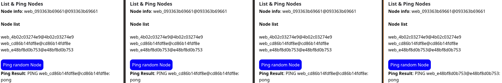
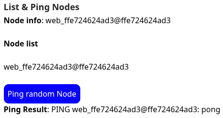

# ClusteringPhoenix

I pretty simple project to demonstrate how to create a phoenix cluster using docker.

## Results

Pings made with [Node.ping()](https://hexdocs.pm/elixir/Node.html#ping/1).

### Multiple containers up and running

### Ping a random node

### Ping yourself because there is just one node

